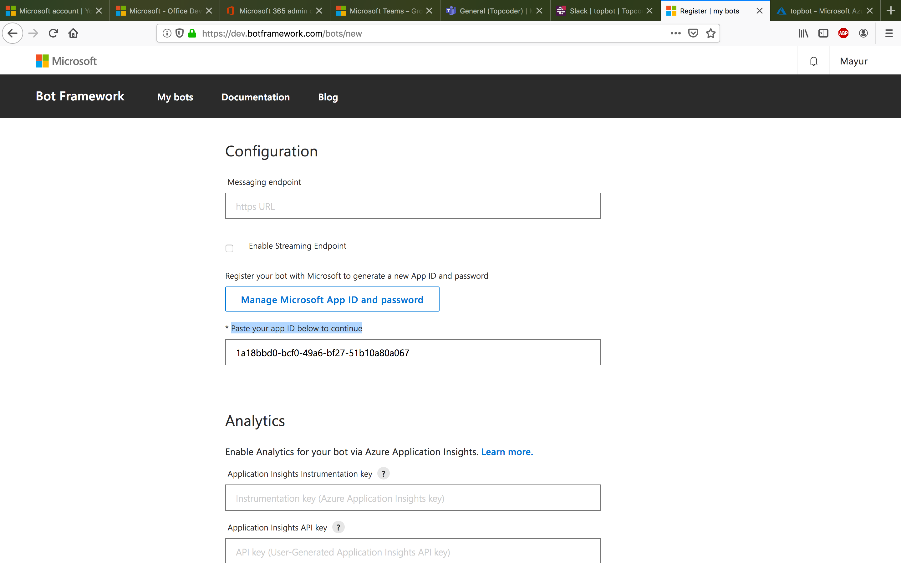

# Deployment Guide

## Prerequisites

1. Node.js >= v12.14.1

2. ngrok: https://ngrok.com/download

## Dynamodb & SNS setup

Teams lambda uses Dynamodb to store/retrieve data and listens to SNS topics to obtain events from Topbot - Receiver.

If you already have dynamodb running, then you can skip the install and run steps 1 and 2

1. Download and install dynamodb from [here](https://docs.aws.amazon.com/amazondynamodb/latest/developerguide/DynamoDBLocal.DownloadingAndRunning.html)

2. In terminal, navigate to the directory where you extracted DynamoDBLocal.jar, and enter the following command. `java -Djava.library.path=./DynamoDBLocal_lib -jar DynamoDBLocal.jar -sharedDb`. This will start dynamodb on port 8000 by default.

3. **ENV** Update `provider:environment:DYNAMODB_ENDPOINT` field in `serverless.yml` with the dynamodb port,

```yml
environment:
  # AWS configuration
  ACCESS_KEY_ID: FAKE_ACCESS_KEY_ID
  SECRET_ACCESS_KEY: FAKE_SECRET_ACCESS_KEY
  REGION: FAKE_REGION
  DYNAMODB_ENDPOINT: http://localhost:8000 # This value
```

4. `serverless-offline-sns` will run a SNS instance locally.

**ENV** Update `custom:serverless-offline-sns:sns-endpoint` field in `serverless.yml` with the SNS port

```yml
serverless-offline-sns:
  port: 4002 # This value
  debug: false
```

Update `provider:environment:SNS_ENDPOINT` with this value.

```yml
environment:
  # SNS Configuration
  SNS_ENDPOINT: http://localhost:4002 # This value should be identical with the value in `serverless-offline-sns`
  SNS_REGION: us-west-2
  SNS_ACCOUNT_ID: 123456789012 # Dummy value in local setup
```

The other SNS config values can be set the same unless you explicitly change it in SNS.

5. [Optional] You can view the contents of dynamodb in your browser using a tool like [dynamodb-admin](https://www.npmjs.com/package/dynamodb-admin)

## Ms Teams setup

### Office 365 subscription

1. Create a new microsoft account if you don't have one already. You can sign up [here](https://account.microsoft.com/account)

2. Add a First and Last name to your account if you don't have one already. Click `Add Name` button [here](https://account.microsoft.com/profile/)


3. Once done, join the Office 365 Developer Program by clicking `Join Now` button [here](https://dev.office.com/devprogram).

If you just added your name in Step 2, you need to wait a couple of hours before you can join the Office 365 Developer Program.


4. Provide country, company name, accept license and click Next


5. Provide required fields, I provided values, `Information technology`, `Personal projects`, `Personal projects`, `Microsoft Teams`. Click `Next`.


6. Click `Set Up Subscription` in the following step, provide username, domain and password and click continue. Remember these values. Your TEAMS_EMAIL for subsequent steps will be `username@domain.onmicrosoft.com` and your TEAMS_PASSWORD will be the password you entered.


7. Provide your phone number for a verification code and enter it


### Admin portal setup

1. Go to [Admin portal](https://portal.office.com/adminportal/home) and sign in using TEAMS_EMAIL and TEAMS_PASSWORD from above

2. Click on `Users` -> `Active Users` -> Select your user -> `Licenses and Apps` in the side menu, Check the license `Microsoft 365 E5 Developer (without Windows and Audio Conferencing)` and click `Save changes`.


### Ms Teams setup

1. Sign in to MS teams [here](https://products.office.com/en-us/microsoft-teams/group-chat-software?SilentAuth=1) using the TEAMS_EMAIL and TEAMS_PASSWORD from above. Click `Use the web app instead`

2. On success, you will see teams. Click `Teams` -> `Create a team` -> `Build a teams from scratch` -> `Public` -> Provide a name and click `Create`


3. Skip adding members. On success, you should see your team created,


### Create a bot

1. Go to https://dev.botframework.com/bots/new and sign in using TEAMS_EMAIL and TEAMS_PASSWORD.

2. Provide details,

  a. Display name

  b. Bot handle


  c. Configuration -> Click Create Microsoft App ID. You will be redirected to Azure. Click `Register an application`. Provide name and select `Accounts in any organizational directory (Any Azure AD directory - Multitenant) and personal Microsoft accounts (e.g. Skype, Xbox)` and click register


  d. Copy you Application (client) id


  e. **ENV** Paste App id back in the `Create bot` -> `Configuration` -> `Paste your app ID below to continue` section. This will be your app id. Provide this value in `serverless.yml` -> `# Client Teams bot configuration` -> `APP_ID`



  f. Accept license and click `Register`

3. On the bot page, click `Add featured channel` -> `Ms Teams`


4. Click `Save`


### App Studio setup

1. Go back to Ms Teams and click `...` -> Search for `App Studio` and `Add` it


2. Click `Manifest Editor` -> `Import Existing App` -> Select `manifest.zip`. Upload it.

3. Click `Edit` manifest


4. In `App details` click `Identification` -> `Generate`

5. In `Capabilities` -> `Bots` -> Click `Delete` to delete any existing bot. Then click, `Setup` -> `Existing bot`

6. Provide name, select existing bot -> choose bot from `Create a bot section`, Check `Scope` Personal, Team and Group and click `Save`


7. **ENV** Under `App passwords` click `Generate new password`. Copy this value to `serverless.yml` -> `# Client Teams bot configuration` -> `APP_PASSWORD`. If the password contains special characters, enclose it in quotes. e.g. `APP_PASSWORD: 'Jips0:0JPN.B-kSuSZG3XWza8I:aFnE:'`

### Central lambda setup

If you haven't already done it, then setup TC Central lambda by following its `DeploymentGuide.md`. Teams lambda will run on port 3002 by default, so use `TEAMS_LAMBDA_URI: 'http://localhost:3002'` in `serverless.yml` of Central TC.

**ENV** By default, Central TC is deployed on port 3000 locally. Update `serverless.yml` (Of teams lambda) -> `CENTRAL_LAMBDA_URI` to this URI.

By now, all required fields in `serverless.yml` should be filled. It should look something like,

```yml
service: teamsBotLambda

provider:
  name: aws
  runtime: nodejs10.x

  environment:
    # AWS configuration
    ACCESS_KEY_ID: FAKE_ACCESS_KEY_ID
    SECRET_ACCESS_KEY: FAKE_SECRET_ACCESS_KEY
    REGION: FAKE_REGION
    DYNAMODB_ENDPOINT: http://localhost:8000

    # Client Teams bot configuration
    APP_ID: b77d1f2c-215a-47e5-9ec9-81bf4ac1ae3c
    APP_PASSWORD: 'Jips0:0JPN.B-kSuSZG3XWza8I:aFnE:'

    # Central TC Lambda URI
    CENTRAL_LAMBDA_URI: 'http://localhost:3000'
```

### Start Teams lambda server

1. Install `serverless` globally. `npm i -g serverless`

2. In the `teams-lambda` directory run `npm i` to install required modules

3. [Optional] Check for lint errors by running `npm run lint`. Fix any errors by running `npm run lint:fix`

4. In the `teams-lambda` directory run `serverless offline` to start the Serverless API gateway on port 3002. The gateway runs the lambda functions on demand.

5. You should see that the SNS topics, `client-teams-events` is created. You can verify this using the aws cli,
`aws --endpoint-url=http://localhost:4575 sns list-topics`
6. Expose the server using `ngrok`. Run `ngrok http 3002`. You will obtain a url like `https://9bb718af.au.ngrok.io`. Note down this value. I will refer to it as `NGROK_URL`.

**NOTE on ngrok**

If you are using a free version of ngrok, it allows only one simultaneous connection. This is a problem if you want to run both Slack lambda and TC Central and expose both using ngrok.

The solution is to use the `--region` field while starting ngrok. So, if you're already running ngrok, you will see a region such as `Region United States (us)` in the terminal.
To start another ngrok session just choose another region to run in by executing `ngrok http 3001 --region au`. This will start ngrok in `Region Australia (au)`

### App studio setup (continued)

8. In `Messaging endpoint` provide value `NGROK_URL/teams/events`

**NOTE** Steps 11, 12 and 13 may not be needed if you just upload `manifest.zip`

11. Click `Add` in `Commands`. Provide values, command text as `request`, Help text `Send a project description message`. Scope all 3 and click `Save`


12. Repeat step 11 for `email` command. Provide values, command text as `email`, Help text `Provide an email id to invite to project`. Scope all 3 and click `Save`


13. Repeat step 11 for `help` command. Provide values, command text as `help`, Help text `Show supported commands`. Scope all 3 and click `Save`

14. Click `Finish` -> `Test and distribute` -> `Download`. Save the zip file

15. Go to `...` -> `More apps` -> `Upload a custom app` and upload the zip file from step 12

16. Click on the uploaded app and `Add` it to team by selecting `Add to team` in dropdown.


17. Now if you go to the `General` or any other new channel you create, you will be able to see `@topbot`.

**NOTE** If the NGROK_URL is changed or is deployed for the first time, you might need to wait for a few minutes before you can issue commands successfully.

## Setup TC Central lambda

1. If you haven't already done it, then setup TC Central lambda by following its `DeploymentGuide.md` before moving on to [Verification Guide](./VerificationGuide.md). Note that if you change the port of TC Central lambda, then you need to update `provider:environment:CENTRAL_LAMBDA_URI` field in `serverless.yml` **and restart** Teams lambda.

Follow steps in [Verification Guide](Verification.md) to verify.
