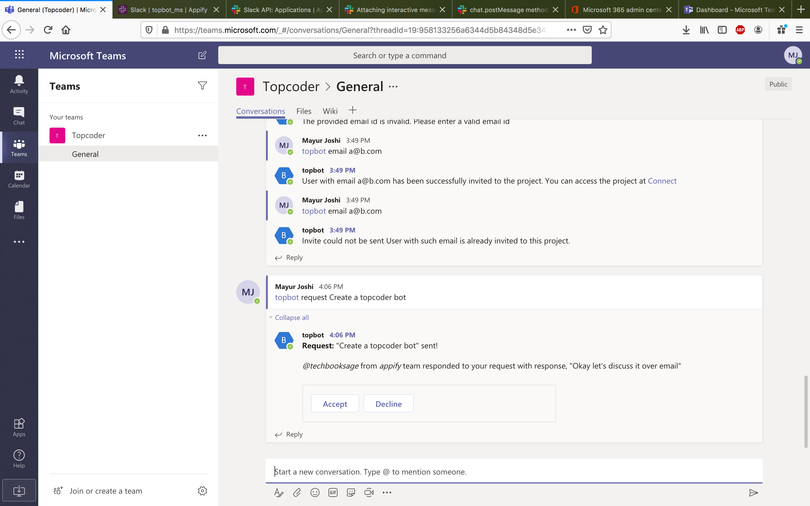

# Verification Guide

Once you have Ms Teams, Slack and the Topbot server setup, you can follow these steps for verification,

1. Issue a command `@topbot request Build a bot using botkit.ai` in a Ms Teams channel.

    You will see two things,

    a. A request acknowledgement is posted to Ms Teams

    b. The request is posted to the configured Slack channel

2. Click on the `Post a response` button in the Slack message. You will see a dialog with a text area where you can add a response. Add a response and click `Post`.

    You will see two things,

    a. An acknowledgement is posted to Slack

    b. The response is posted back to Ms Teams

3. Click on the `Post a response` button in the Slack message again. You will see a message saying that request is no longer available.

