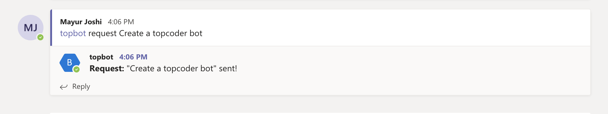

# Verification Guide

Once you have Ms Teams, Slack and the Topbot server setup, you can follow these steps for verification,

1. The Connect token has a short expiry time. It is best to refresh the token.
    a. Stop the running server.

    b. Follow steps in `Start server` -> `Obtain Connect User token` of [Deployment Guide](Deployment.md) to obtain a new token.

    c. Once you have the new token in `.env`, restart the server. No other changes or setup is needed.

    d. **NOTE** If you see a message like `Failed to authenticate token.` then it means that the token has expired. You need to repeat Step 1 and get a new token.

2. Issue a command `@topbot request Create a topcoder bot` in a Ms Teams channel.

    You will see two things,

    a. A request acknowledgement is posted to Ms Teams

    b. The request is posted to the configured Slack channel

2. Click on the `Post a response` button in the Slack message. You will see a dialog with a text area where you can add a response. Add a response and click `Post`.

    You will see two things,

    a. An acknowledgement is posted to Slack

    b. The response is posted back to Ms Teams with the `accept` and `decline` buttons

3. Click on the `Accept` button in Ms Teams

    Observe,

    a. An acknowledgement is posted to Ms Teams

    b. A message with `Provide project name` is posted to slack

4. Click on the `Provide project button`. You will see a dialog where you can enter the project name. Add a name and click `Post`.

    Observe,

    a. A project created message is posted to Ms Teams

    b. An acknowledgement is posted to Slack

5. Provide an email using `@topbot email mayur.gmail.com` as a reply to the project created message

    Observe,

    a. An invite confirmation message is posted to Ms teams with a link to the Connect project

    b. A message is posted to Slack saying user has been invited

6. Open the `Connect` link and login using `mess`/`appirio123`. You will see the created project along with the invited user

7. You can repeat Steps 1 and 2 and click the `Decline` button. You will see a message posted to Slack

8. You can also try different scenarios

    a. Invite user who is already invited

    b. Try email command in non request thread

    c. Multiple clicks on Accept and Decline
